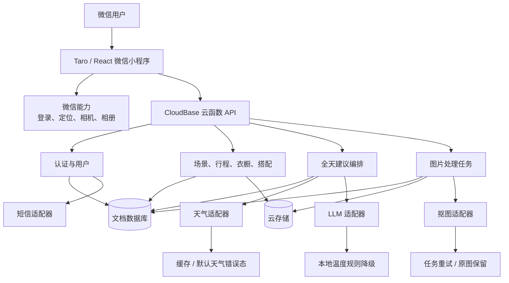
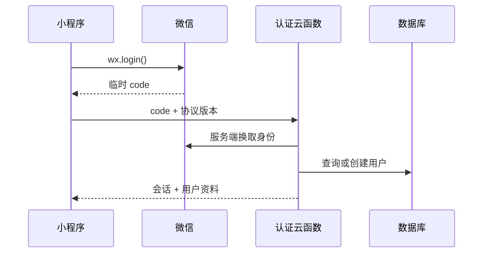

# 穿衣有数｜MVP 技术方案

> 本方案描述生产微信小程序架构。当前 React/Vite/Express 原型只作为 UI、交互与领域规则参照。

微信开发者工具、平台配置、体验版、提审和发布流程见 [WECHAT_MINIPROGRAM.md](./WECHAT_MINIPROGRAM.md)。

## 1. 架构目标

- 用最少生产组件交付完整 MVP 主链路。
- 保持 React 迁移成本可控，同时遵循微信小程序运行约束。
- 隔离天气、LLM、短信和抠图供应商，支持超时、降级与替换。
- 用户数据默认服务端持久化，关键关联变更具备原子性。
- 让每个业务域可独立开发、测试和回滚，不引入微服务复杂度。

## 2. 技术选型

| 层 | 选型 | 原因 |
|---|---|---|
| 小程序 | Taro 3.x + React 18 + TypeScript | 延续当前 React 心智，同时输出微信小程序代码 |
| UI | Taro 基础组件 + 自研业务组件 + SCSS/CSS Modules | 保持已确认视觉，不受通用组件库风格绑架 |
| 后端 | CloudBase Node.js 20 云函数 | 小程序身份、数据库和存储集成成本低 |
| 数据库 | CloudBase 文档数据库 | 数据对象天然文档化，适合 MVP 快速演进 |
| 文件 | CloudBase 云存储 | 管理头像、衣物原图、透明图和搭配预览 |
| 异步任务 | 云函数 + 任务记录 | 支持抠图耗时、重试和状态查询 |
| 共享契约 | TypeScript DTO + 运行时 schema | 保持前后端字段与错误语义一致 |

Taro 遵循小程序组件、路由和 API 规范，不能假设浏览器 DOM 能力；CloudBase Node SDK 可在云函数内直接访问数据库与存储。[Taro React 官方说明](https://docs.taro.zone/docs/react-overall)，[CloudBase 资源调用说明](https://docs.cloudbase.net/cloud-function/resource-integration/cloudbase)。

## 3. 系统架构图



## 4. 模块划分

### 4.1 小程序

- `auth`：微信登录、手机号登录入口、协议确认和会话恢复。
- `weather`：定位授权、城市级定位、天气展示和刷新。
- `itinerary`：当天行程查询、创建、编辑和删除。
- `scenes`：预设/自定义场景与引用规则。
- `recommendation`：提交完整当天上下文、展示生成与降级结果。
- `wardrobe`：筛选、上传、抠图状态、编辑和删除。
- `try-on`：自由画布、衣物节点变换、层级和保存/恢复。
- `profile`：用户资料、体感偏好、权限说明、数据清理和退出。

### 4.2 服务端

- API 入口：认证、输入校验、幂等、响应信封。
- 应用用例：编排业务流程和事务。
- 领域规则：预设场景保护、引用同步、全天建议输入构造等。
- 仓储层：数据库和存储访问。
- 外部适配层：天气、LLM、短信、抠图。
- 可观测层：结构化日志、requestId、耗时、降级和失败指标。

## 5. 核心数据模型

所有业务集合必须包含 `id`、`userId`（公共预设除外）、`createdAt`、`updatedAt` 和必要的 `version`。

```text
users
  id, wechatOpenId, phoneHash?, nickname, avatarFileId?,
  recentFeelPreference, createdAt, updatedAt

scenes
  id, userId?, name, type, estimatedTemperatureCelsius,
  feel, isPreset, note?, createdAt, updatedAt

itineraries
  id, userId, localDate, startTime, sceneId,
  estimatedTemperatureCelsius, durationMinutes, createdAt, updatedAt

clothing
  id, userId, name, category, colors[],
  sourceFileId, processedFileId?, processingStatus,
  createdAt, updatedAt

outfits
  id, userId, name, seasonTags[], colorTags[],
  canvasVersion, nodes[], createdAt, updatedAt

imageProcessingJobs
  id, userId, clothingId, status, attempt,
  sourceFileId, resultFileId?, errorCategory?, createdAt, updatedAt

recommendationSnapshots
  id, userId, localDate, inputHash, weatherSnapshot,
  itinerarySnapshot, result, source, createdAt, expiresAt
```

`nodes[]` 包含 `clothingId`、归一化 `x/y`、`scale`、`rotation`（MVP 如不支持则固定为 0）和 `zIndex`。不建立未来行程、体感反馈快照和衣物软删除模型。

## 6. 关键数据流

### 6.1 登录与会话



手机号登录先发送验证码，再用 `challengeId + code` 换取会话；服务端执行频率限制和审计。

### 6.2 天气与全天建议

1. 小程序申请定位，只上传城市识别所需信息。
2. 天气云函数查询供应商并写入短时缓存。
3. 用户主动生成建议时，小程序只提交必要触发参数。
4. 服务端读取当天完整行程、场景和体感偏好，生成稳定输入快照。
5. LLM 在超时内返回结构化结果；失败时调用本地温度规则并标记 `source=rules`。
6. 结果缓存到当天输入哈希，避免重复生成。

### 6.3 衣物上传与抠图

1. 客户端校验类型和大小并获取上传能力。
2. 原图进入用户隔离路径，创建 `clothing` 草稿和任务。
3. 处理函数调用抠图适配器，成功后写透明图并更新任务。
4. 客户端查询任务状态，展示处理中、成功对比或失败重试。
5. 用户确认后衣物入库；取消或超时任务执行临时文件清理。

### 6.4 试穿保存与恢复

客户端在统一逻辑画布中计算归一化坐标；保存时服务端校验所有 `clothingId` 属于当前用户。打开搭配时按当前画布尺寸反算位置，并对越界节点进行安全夹取。

## 7. 一致性与并发

- 场景修改后，当天行程展示温度按产品规则同步；服务端事务更新或读取时派生，实施时二选一并通过契约固定。
- 删除被搭配引用的衣物时，确认后在事务中从相关 `outfits.nodes` 移除并删除衣物记录。
- 更新对象携带 `version`，版本不一致返回 `CONFLICT` 并要求刷新。
- 所有创建和耗时任务接口支持幂等键。

## 8. 可靠性与降级

| 能力 | 超时建议 | 重试 | 降级 |
|---|---:|---|---|
| 天气 | 2 秒 | 最多 1 次 | 短时缓存；无缓存则友好错误 |
| LLM | 4 秒 | 不在同步请求内盲目重试 | 本地温度规则 |
| 抠图 | 8 秒/次 | 后台最多 2 次 | 保留原图并允许用户重试 |
| 短信 | 3 秒 | 由用户重新触发且受限流 | 不绕过验证 |

断网时保留用户尚未提交的表单草稿；写请求失败不得制造“已保存”假状态。

## 9. 安全与合规

- 云函数从平台可信身份解析用户，不接受客户端指定所有者。
- 数据库规则和服务端仓储双重校验 `userId`。
- 精确定位不持久化；日志只记录城市级结果和脱敏指标。
- 图片使用私有存储与短期访问 URL。
- LLM 输入不包含衣橱具体清单、手机号、精确定位和无关个人信息。
- 用户协议、隐私政策和权限用途在首次相关操作前展示。

## 10. 可观测性

每次请求记录 `requestId`、业务域、结果、耗时、是否降级和脱敏错误类别。核心指标：

- 登录成功率、验证码发送成功率。
- 天气成功率和 P95 延迟。
- 建议生成成功率、规则降级率和 P95 延迟。
- 抠图成功率、平均耗时和重试率。
- 保存搭配成功率、冲突率。

不得记录请求正文中的手机号、Token、完整位置和图片 URL。

## 11. 技术风险与验证

| 风险 | 影响 | 缓解与前置验证 |
|---|---|---|
| React Web 到 Taro 差异 | DOM、路由和样式不能直接迁移 | 先做登录、底部导航和自由画布三个技术 Spike |
| 自由画布触摸与坐标 | 不同机型恢复偏移、手势冲突 | 使用逻辑画布、归一化坐标和真机矩阵测试 |
| 抠图质量和耗时 | 用户无法完成入库 | 异步任务、前后对比、失败重试和供应商适配 |
| LLM 延迟与不稳定 | 首页主链路阻塞 | 4 秒超时、结构化输出、本地规则降级 |
| 天气供应商与定位偏差 | 建议输入错误 | 城市级缓存、来源时间、刷新和错误态 |
| Taro/React 版本兼容 | 构建或运行时差异 | 锁版本、最小样板验证后再迁移页面 |
| 小程序包体积 | 构建失败或首屏慢 | 分包、图片压缩、按需加载、包体监控 |
| 手机号登录成本与合规 | 短信费用、风控与资质 | 在对应任务前完成供应商、模板和资质 Gate |

## 12. 架构决策门

以下事项在实现前需要用户确认，未确认不得绑定到具体供应商：

- 小程序 AppID、主体、服务类目、开发成员和体验成员。
- 微信开发者工具版本、CLI 路径、最低基础库与构建输出目录。
- CloudBase 环境 ID、地域、配额和计费方式。当前 MVP 已确认仅使用上海地域的 `ootd-ai-dev`，不创建独立测试或生产环境。
- 合法域名、隐私保护指引、用户协议和隐私政策。
- 天气服务供应商及配额。
- LLM 服务供应商、模型和数据处理区域。
- 抠图供应商、费用和图片保留策略。
- 短信供应商、签名、模板和风控方案。
- CloudBase 环境、地域和生产数据保留周期。
