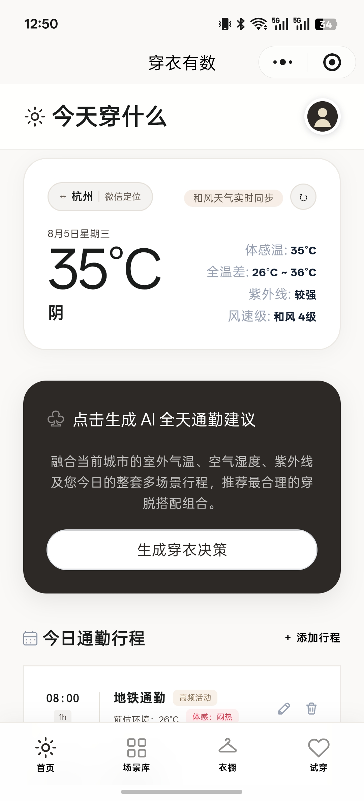
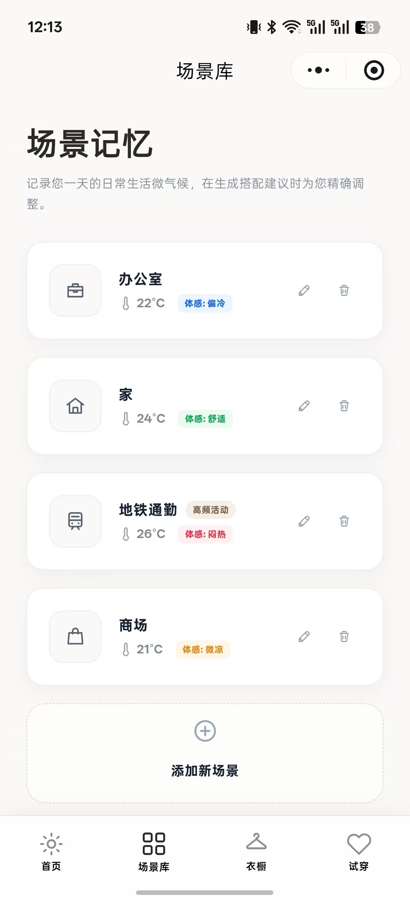
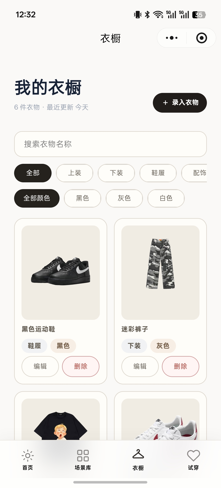
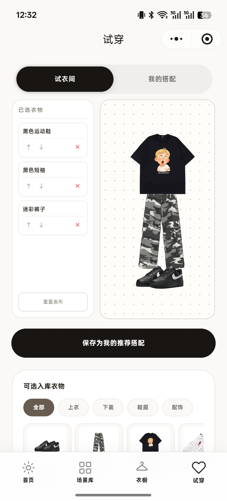
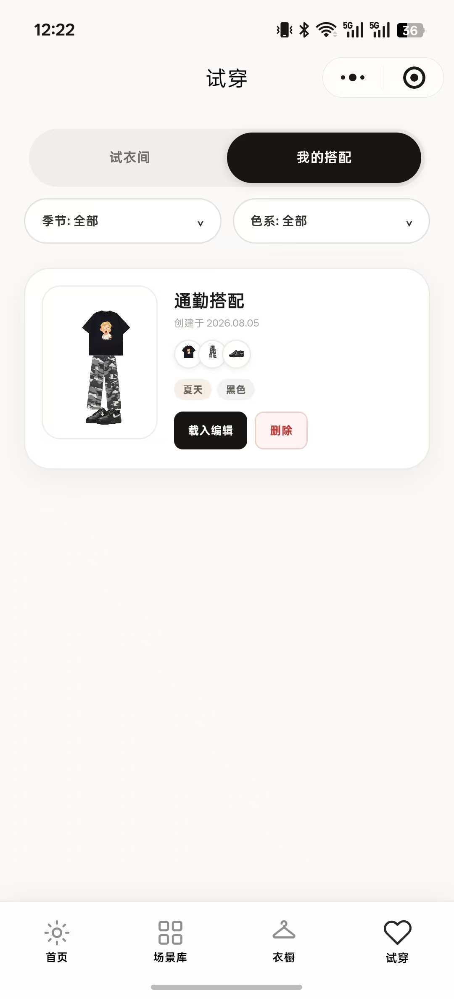

<div align="center">
  
  <h1>穿衣有数</h1>
  <p><strong>结合天气、全天行程和场景温度，给出真正适合通勤一天的穿衣建议。</strong></p>
  <p>微信小程序 · AI 全天穿衣建议 · 场景温度管理 · 数字衣橱 · 自由试穿</p>
</div>

## 项目简介

“穿衣有数”是一款面向城市通勤人群的微信小程序。它会结合实时天气、当天完整行程、不同场景的估计温度和用户体感偏好，生成一套可通过穿脱应对全天温差的穿衣方案。

AI 只提供衣物类型、材质和薄厚建议，不会从用户衣橱中自动挑选具体衣物。未登录用户也能使用示例数据体验核心功能；只有保存个人数据、提交评价或调用相机和相册时，才按需触发微信登录。

> 仓库同时包含 React/Vite 交互原型和基于 Taro + React 的微信小程序实现。产品事实以 [PRODUCT.md](./PRODUCT.md) 为准，开发进度以 [PROGRESS.md](./PROGRESS.md) 为准。

## 产品预览

### 一眼看懂今天怎么穿

首页依次呈现当地天气、AI 全天穿衣建议和当天行程，让用户看清室外、地铁和办公室之间的温差，并获得可执行的穿脱建议。

<p align="center">
  
</p>

### 管理场景与衣橱

<table>
  <tr>
    <td align="center"></td>
    <td align="center"></td>
  </tr>
  <tr>
    <td align="center"><strong>场景库</strong><br />记录办公室、家、地铁等场景的温度与体感</td>
    <td align="center"><strong>数字衣橱</strong><br />搜索、筛选、录入和管理衣物</td>
  </tr>
</table>

### 在自由画板中完成搭配

<table>
  <tr>
    <td align="center"></td>
    <td align="center"></td>
  </tr>
  <tr>
    <td align="center"><strong>自由试穿</strong><br />自由移动、缩放和调整衣物层级</td>
    <td align="center"><strong>我的搭配</strong><br />保存、筛选并再次载入画板状态</td>
  </tr>
</table>

## 核心能力

- **全天穿衣建议**：综合当天全部行程、室外天气、场景温度和体感偏好，给出一套可穿脱调整的方案。
- **实时天气与定位**：通过微信定位识别城市；授权拒绝或服务异常时保留通用天气和重试入口。
- **当天行程**：围绕已有场景管理当天行程，记录开始时间、温度和停留时长。
- **场景温度管理**：统一管理预设与自定义场景，支持估计温度、体感和备注。
- **轻量数字衣橱**：支持搜索、分类、颜色筛选、图片录入、编辑和删除。
- **自由试穿画板**：支持移动、缩放、层级调整、删除以及搭配状态恢复。
- **游客体验与按需登录**：游客可以用示例场景、行程、衣物和搭配体验完整主链路。
- **降级与隐私保护**：外部服务具备超时和失败降级，密钥和精确定位不进入前端或日志。

## 技术架构

| 层级 | 主要技术 | 职责 |
| --- | --- | --- |
| 微信小程序 | Taro 4.2、React 18、TypeScript、Sass | 生产端页面、交互、权限和游客体验 |
| Web 原型 | React 18、Vite、TypeScript、Tailwind CSS | 已确认的产品交互与视觉基线 |
| 本地服务 | Express、TypeScript | 原型服务及接口兼容层 |
| 云端能力 | CloudBase、云函数 | 数据存储与天气、LLM、图片服务编排 |
| 共享契约 | TypeScript package | 前后端数据结构与接口校验 |
| 质量保障 | Vitest、Node Test Runner、ESLint、Prettier | 测试、静态检查和格式检查 |

生产调用链为“小程序 → CloudBase 云函数 → 天气／大模型／图片处理服务”。外部服务不可用时，建议接口可以回退到本地温度规则。

## 项目结构

```text
.
├─ miniprogram/          # Taro + React 微信小程序
├─ cloudfunctions/api/   # CloudBase API 云函数
├─ packages/contracts/   # 前后端共享类型与契约
├─ src/                  # React/Vite 交互原型
├─ server.ts             # 原型 Express 服务
├─ tests/                # 根级基线测试
├─ docs/                 # 项目图片与辅助资料
├─ PRODUCT.md            # 产品边界与验收事实
├─ DESIGN.md             # 视觉与交互规范
├─ ARCHITECTURE.md       # 生产架构与数据流
└─ PROGRESS.md           # 里程碑、决策与当前状态
```

## 本地开发

### 环境要求

- Node.js 20+
- npm
- 微信开发者工具（运行小程序时需要）

### 安装依赖

```powershell
npm install
npm --prefix miniprogram install
npm --prefix packages/contracts install
npm --prefix cloudfunctions/api install
```

### 配置环境变量

```powershell
Copy-Item .env.example .env
```

按需填写本地配置，请勿提交真实密钥。`GEMINI_API_KEY` 仅用于旧原型兼容，可留空；留空时原型建议接口使用本地温度规则。

### 运行 Web 原型

```powershell
npm run dev
```

访问 [http://127.0.0.1:3000](http://127.0.0.1:3000)。

### 构建微信小程序

```powershell
npm run build:weapp
```

构建后使用微信开发者工具打开仓库根目录。账号、环境、体验版和发布流程见 [WECHAT_MINIPROGRAM.md](./WECHAT_MINIPROGRAM.md)。

## 测试与质量检查

执行完整质量门禁：

```powershell
npm run quality
```

或按范围检查：

```powershell
npm run test:baseline
npm run test:weapp
npm run test:contracts
npm run test:cloudfunctions
npm run lint
npm run build
```

## 当前状态

- MVP 核心页面与微信小程序生产实现已完成。
- 游客体验、按需登录、示例数据和账号数据隔离已通过整体验收。
- 微信小程序开发版本 `0.11.1` 已上传；体验版、提审与发布状态以 [PROGRESS.md](./PROGRESS.md) 最新记录为准。
- React/Vite 原型继续作为 UI 和交互基线，不代表最终生产架构。

## 产品边界

当前 MVP 聚焦每日穿衣决策，暂不包含未来 7 天或历史行程、从行程新建场景、衣物软删除占位、OOTD 日历、每日穿搭照片和分享卡片。首页城市仅由微信定位识别，不提供手动切换。

## 文档导航

| 文档 | 内容 |
| --- | --- |
| [PRODUCT.md](./PRODUCT.md) | 产品事实、业务规则与验收要求 |
| [DESIGN.md](./DESIGN.md) | 页面结构、视觉系统与交互规范 |
| [ARCHITECTURE.md](./ARCHITECTURE.md) | 系统架构、模块、数据流与技术风险 |
| [DEVELOPMENT.md](./DEVELOPMENT.md) | 技术栈、代码、接口、安全与交付规范 |
| [TASK.md](./TASK.md) | 开发里程碑、依赖与验收门槛 |
| [TEST.md](./TEST.md) | 测试分层、用例矩阵与质量门禁 |
| [WECHAT_MINIPROGRAM.md](./WECHAT_MINIPROGRAM.md) | 微信配置、体验版、提审与发布流程 |
| [METRICS.md](./METRICS.md) | MVP 指标定义、计算口径与报告方式 |
| [PROGRESS.md](./PROGRESS.md) | 当前状态、关键决策、阻塞与下一步 |

## 参与开发

提交改动前请阅读 [AGENTS.md](./AGENTS.md) 和相关领域文档。保持改动聚焦，为行为变化补充测试，并确保不提交 `.env`、真实密钥、日志、缓存、构建产物或用户隐私数据。

## License

本仓库暂未声明开源许可证。在许可证明确前，默认保留全部权利。
